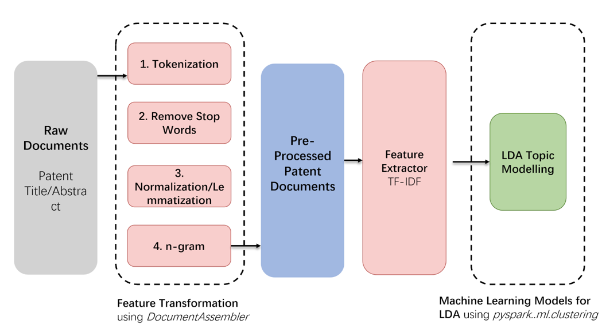
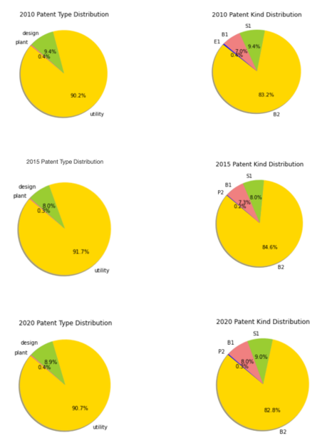
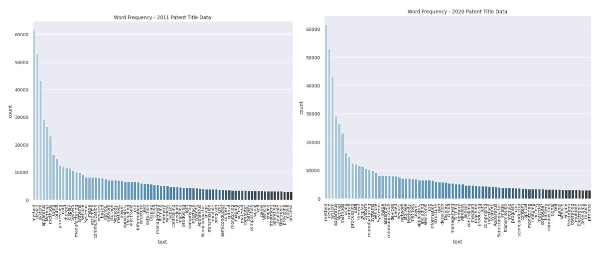
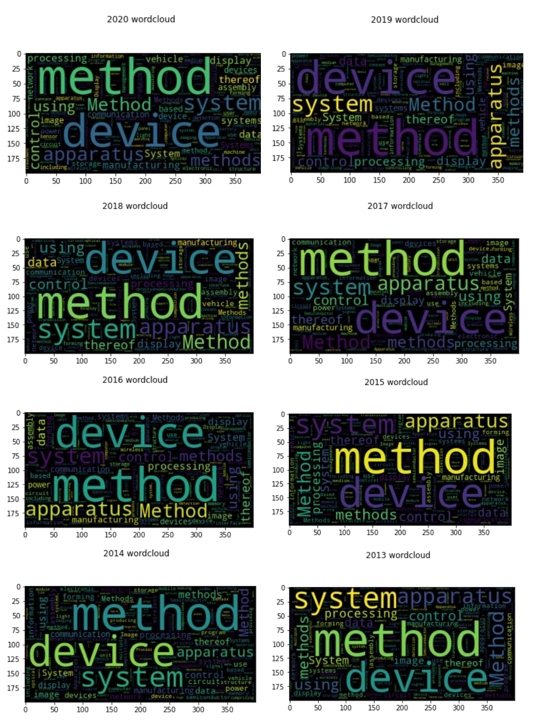
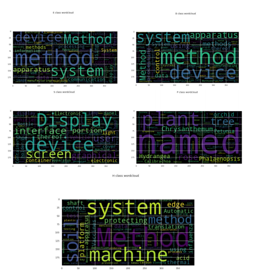
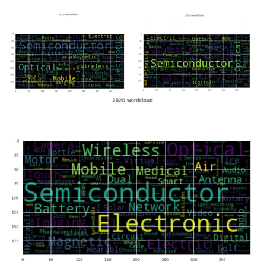

# Final-project-boom-shaka-laka
final-project-boom-shaka-laka created by GitHub Classroom

## Project Report
Group name: Boom-shaka-laka

Students: 

Yingxuan Liu (yingxuan@uchicago.edu)

Chuqing Zhao (cqzhao@uchicago.edu) 

Sirui Zhou (siruiz@uchicago.edu)

Yi Qian (yiq@uchicago.edu)

### 1. Project overview
This project explores the topic of innovation spread across industries using patent citation and abstract data. Through analyzing the dynamics of the patent citation behaviors across industries and across years, we would like to find the spread patterns of patents within and across industries. To achieve this goal, we build our project based on the the PySpark framework for parallel computing. We choose Spark framework to conduct our research. We choose Spark because it is fast, allows interactive sessions, and handles parallel computing implicitly and provides a higher level API. This setting is particularly suitable for us to work on these large datasets of patents and work as a team of four to cooperate smoothly. 

We perform several large data mapping, merging, and transforming; further, we conducted network analysis and trend analysis based on the cleaned dataset. Further, we use the NLP methods for parallel computing of various calculations and comparison, including topic modeling, word frequency by year and name entity recognition. The large-scale computing strategy in the NLP part contains PySpark NLP and Apache Spark, in which we mainly apply the pipeline to convert words into vectors (such as normalization, lemmatization, etc). From the results, we find patterns of technology and innovation spread from 2011 to 2020.
### 2. Data Description

Please refer to [final_data_merging_cleaning_counting_.ipynb](https://github.com/lsc4ss-s21/final-project-boom-shaka-laka/blob/main/final_data_merging_cleaning_counting_.ipynb)

For this specific project, we focus on patents granted in the U.S due to the magnitude of the citation data. This means that, for a citation pair where A cited B, both A and B were patents granted in the U.S. We use a total of four datasets: (1) the U.S. patent citation data, (2) CPC Current data, (3) CPC subsection data, and (4) Single Patent Data Record Set. All four datasets are downloaded through the United States Patent and Trademark office website: https://patentsview.org/download/data-download-tables and due to the huge volume of the file, they were directly downloaded from colab into google drive.

#### 1) uscitation table (115,170,634 rows, 11GiB) - Citations made to US granted patents by US patents

| uspatentcitation  | Citations made to US granted patents by US patents                                                                                                 |                           |                |             |
|-------------------|----------------------------------------------------------------------------------------------------------------------------------------------------|---------------------------|----------------|-------------|
| DATA ELEMENT NAME | DEFINITION                                                                                                                                         | EXAMPLE                   | YEARS PRESENT  | TYPE        |
| uuid              | unique id                                                                                                                                          | 000007b7c0x3n9iy1othb9hz7 | all            | varchar(36) |
| patent_id         | patent number                                                                                                                                      | 9009250                   | all            | varchar(20) |
| citation_id       | identifying number of patent to which select patent cites                                                                                          | 8127342                   | all            | varchar(20) |
| date              | first day of the month the cited patent (citation_id) was granted                                                                                  | 2/1/12                    | all            | date        |
| name              | name of cited record                                                                                                                               | Boynton et al.            | all            | varchar(64) |
| kind              | WIPO document kind codes (http://www.uspto.gov/learning-and-resources/support-centers/electronic-business-center/kind-codes-included-uspto-patent) | B2                        | 2002 and After | varchar(10) |
| country           | country cited patent was granted (always US)                                                                                                       | US                        | all            | varchar(10) |
| category          | who cited the patent (examiner, applicant, other etc)                                                                                              | cited by patent           | 2002 and After | varchar(64) |
| sequence          | order in which this reference is cited by select patent                                                                                            | 622                       | all            | int(11)     |
|                   |                                                                                                                                                    |                           |                |             |

### 2) cpc_current table (42,698,187 rows, 3.2GiB) - Current CPC classification data for all patents (applied retrospectively to all patents)
| cpc_current       | Current CPC classification of the patent                                                                                                                                                                                                                                                                                       |                           |               |             |
|-------------------|--------------------------------------------------------------------------------------------------------------------------------------------------------------------------------------------------------------------------------------------------------------------------------------------------------------------------------|---------------------------|---------------|-------------|
| DATA ELEMENT NAME | DEFINITION                                                                                                                                                                                                                                                                                                                     | EXAMPLE                   | YEARS PRESENT | TYPE        |
| uuid              | unique id                                                                                                                                                                                                                                                                                                                      | w75uqbz5sanvuh9okis0agfua | all           | varchar(36) |
| patent_id         | patent number                                                                                                                                                                                                                                                                                                                  | 3930271                   | all           | varchar(20) |
| section_id        | cpc section (A = Human Necessitates, B = Performing Operations; Transporting, C = Chemistry; Metallurgy, D = Textiles; Paper, E = Fixed Constructions, F = Mechanical Engineering; Lighting; Heating; Weapons; Blasting Engines or Pumps, G = Physics, H = Electricity, Y = General Tagging of New Technological Developments) | A                         | all           | varchar(10) |
| subsection_id     | cpc subsection id: https://www.uspto.gov/web/patents/classification/cpc/html/cpc.html                                                                                                                                                                                                                                          | A63                       | all           | varchar(20) |
| group_id          | cpc group id: https://www.uspto.gov/web/patents/classification/cpc/html/cpc.html                                                                                                                                                                                                                                               | A63B                      | all           | varchar(20) |
| subgroup_id       | cpc subgroup id: https://www.uspto.gov/web/patents/classification/cpc/html/cpc.html                                                                                                                                                                                                                                            | A63B71/146                | all           | varchar(20) |
| category          | cpc category (primary or additional)                                                                                                                                                                                                                                                                                           | inventional               | all           | varchar(36) |
| sequence          | order in which cpc class appears in patent file                                                                                                                                                                                                                                                                                | 0                         | all           | int(11)     |

### 3） cpc_subsection table (136 rows, 7.9KiB) - Lookup table of current CPC subsections
| cpc_subsection    | CPC subsection classification at issue of the patent |                                                                     |               |              |
|-------------------|------------------------------------------------------|---------------------------------------------------------------------|---------------|--------------|
| DATA ELEMENT NAME | DEFINITION                                           | EXAMPLE                                                             | YEARS PRESENT | TYPE         |
| id                | cpc subsection id                                    | A01                                                                 | all           | varchar(20)  |
| title             | description of cpc subsection                        | AGRICULTURE; FORESTRY; ANIMAL HUSBANDRY; HUNTING; TRAPPING; FISHING | all           | varchar(256) |

### 4） Patent table （7,627,229 rows, 5.6 GiB) - Data on granted patents
| patent            | Data concerning granted patents                                                                                                                    |                              |               |              |
|-------------------|----------------------------------------------------------------------------------------------------------------------------------------------------|------------------------------|---------------|--------------|
| DATA ELEMENT NAME | DEFINITION                                                                                                                                         | EXAMPLE                      | YEARS PRESENT | TYPE         |
| id                | patent this record corresponds to                                                                                                                  | 3930271                      | all           | varchar(20)  |
| type              | category of patent. Usually "design", "reissue", etc.                                                                                              | utility                      | all           | varchar(100) |
| number            | patent number                                                                                                                                      | 3930271                      | all           | varchar(64)  |
| country           | country in which patent was granted (always US)                                                                                                    | US                           | all           | varchar(20)  |
| date              | date when patent was granted                                                                                                                       | 1/6/76                       | all           | date         |
| abstract          | abstract text of patent                                                                                                                            | A golf glove is disclosed h… | all           | mediumtext   |
| title             | title of patent                                                                                                                                    | Golf glove                   | all           | mediumtext   |
| kind              | WIPO document kind codes (http://www.uspto.gov/learning-and-resources/support-centers/electronic-business-center/kind-codes-included-uspto-patent) | A                            | all           | varchar(10)  |
| num_claims        | number of claims                                                                                                                                   | 4                            | all           | int(11)      |
| filename          | name of the raw data file where patent information is parsed from                                                                                  | pftaps19760106_wk01.zip      | all           | varchar(120) |
| withdrawn         | whether a patent has been withdrawn or not (withdrawn = 1, not withdrawn = 0)                                                                      | 0                            | all           | int(11)      |

## 3. Data Merge and Preprocessing

The four datasets are separated into two workflows: the analysis of dataset 1-3 and the the analysis of dataset 4.

### 1) Merging 1-3 and processing

Please refer to [final_data_merging_cleaning_counting_.ipynb](https://github.com/lsc4ss-s21/final-project-boom-shaka-laka/blob/main/final_data_merging_cleaning_counting_.ipynb)

Our target in this section of the project is to merge very large datasets. Since we would like to see the industry to industry citation pattern in our project. We need to merge (1) the U.S. patent citation data, (2) CPC Current data, (3) CPC subsection data, in the following order:
1. Slice away irrelevant information in 1 & 2 such as category or sequence, creating a new version of 1 & 2.
2. Merge the new 1 and 2 on the same key - patent_id, enabling each patent record to have its own subsection id (at this point, there is no information about the details of the subsections, you can only see, for example, 3930271 - A63), we call this panel dataset 5. The specific method is left join.
3. Switch the column name of 2. Then merge 5 and 2 on citation_id, adding new information about the citation patent's subsection information, we call this the new 5.
4. Merge the new 5 with 3, eventually yielding the new citation dataset with full information.

We utilized the Spark Dataframe to carry out merges and data analysis.

### 2) Preprocessing 4
NLP pipeline: to convert data into PySpark and Spark NLP pipeline, we first clean the data and get lemmatization unigrams by using DocumentAssembler. Next, we tokenize data, convert data into lowercase with Tokenizer and Normalizer. Then we use LemmatizerModel to lemmatize text with a pre-trained lemming  model by Spark NLP. We downloaded the NLTK stopword list for English and removed all stop words. 

In the data analysis part, we hope to find the most frequent words in patent documents. We count the number of word frequencies and visualize the result into word clouds by years. Then, to extract more informative entities, we choose to use NER (name-entity recognition), and plot word clouds. 

In the following part, we cluster the documents and analyze topics by using the LDA (Latent Dirichlet Allocation) model. We assign the number of topics equal to 6. Before applying the machine learning model, we extract features and vectorize words in documents. 

## 4. Results

### 1) Citation analysis 

#### Network Analysis
Please refer to [final_network.ipynb](https://github.com/lsc4ss-s21/final-project-boom-shaka-laka/blob/main/final_network.ipynb)

With the merged dataset containing the subsections of the patent and citation and the corresponding counts, we are able to plot a network graph indicating the citation relationship and the corresponding subsection.  For example, if we specify the records counts to be 1,000,000 or above, we find a small graph and if we specify the records counts to be 100,000 or above, the graph grows to be rich and complex. 

From the second network, we see a significant node of Y10, which attracting major citations. Based on our knowledge from dataset `cpc_subsection`, the Y10 represents "TECHNICAL SUBJECTS COVERED BY FORMER USPC", so the results make intuitive sense.  

For the first network, we see another important relationship of ’G06‘ and ’H04‘ citing each other. Because these nodes are "ELECTRIC COMMUNICATION TECHNIQUE" and "COMPUTING; CALCULATING; COUNTING", we are able to learn from the data the burgeoning area of computing and communication develops a significant amount of patents and closely interdependent in the past few decades.

Similarly, there are other noticeable nodes such as ‘G02’ or ‘Y2’. Our `look_up` function allows us to further explore the detailed information and learn more about the citation relationships between the scientific areas, with specified nodes and counting numbers. 

#### Trend Analysis

One of our goal for this project is to examine the citation behaviors of patents across industries (subsections). Using results obtained from the merged datasets, we then count the number of citing industry – cited industry pairs. However, 0.1 Billion rows took too long to process and after 18 hours of waiting, I have to shut down the process and used a smaller slice of data to show my readers what is happening.

One thing notable is that by dropping the extreme values, we eliminated the cases that patent_id’s citing subsection is the same as the cited patent’s citing subsection since it is the most amongst all other types of citations. By referring to the heatmap below, we can observe a lot of useful information: 1) The diagonal: the diagonal is not necessarily our just-sayed “same” subsection and the grids are darker, indicating that the citations are the most compared to other citing-cited sets; 2) The two boxes on both corners: those boxes show that the most citations happen under the same **section**; 3) The vertical line and the horizontal line: these two lines, pointing to B05 (SPRAYING OR ATOMISING IN GENERAL; APPLYING LIQUIDS OR OTHER FLUENT MATERIALS TO SURFACES, IN GENERAL) and C14 (SKINS; HIDES; PELTS; LEATHER), showing that they do not quote other industries rather than themselves.

 (if it doesn't show please check 4.png)
We could either look into one subsection’s changes through time, or we could look at several sections at once if we have enough computing resources, both will all give me about the invention spread through time..

### 2) Text analysis 

**2.1 Patents Overall Look**

From the chart of the total number of patents during the last decade, we can observe a mildly increasing trend. If we have a panoramic look at the patent data, we can find that the distributions of type of patents and patent kind remain stable respectively. Patents are categorized into three types: utility, design, and plant. A utility patent covers the creation of a new or improved and useful product, process, or machine. It is also known as a "patent for invention, which protects the inventor’s exclusive rights of making, using, and selling. A design patent is a form of legal protection granted to the ornamental design of a functional item. Last but not least, a plant patent is granted for newly invented strains of asexually reproduced plants. During the recent decade, utility patents contribute to about 90% of total new granted patents, while the combination of design and plant patents contribute to the rest. 

Patent kind codes, such as B1, B2, S1, in the pie chart, refer to the World Intellectual Property Organization (WIPO) Standard ST.16 code. Since 2001, USPTO has started to use the “kind codes” to distinguish the type of patents as well as the level of publication of patents. B1 refers to Utility Patent Grant without pre-grant publication and B2 refers to those with pre-grant publication. S1 still means the design patent. 

**2.2 Word clouds by year**

After finishing preprocessing data, we used spark natural language processing (NLP) to explore patent abstract work frequency and visualize results by word cloud. A Word Cloud is an excellent option to help us visually interpret text and is useful in quickly gaining insight into the most prominent items in a given text, by visualizing the word frequency in the text as a weighted list.

The result shows that the overall world frequency does not change dramatically during 2011-2020, vocabularies such as “method”, “device”, “system”, “ apparatus” are prominent in the patent abstract text. This is consistent with our expectation. According to our observation about patent documents, these words occur highly frequently in patent documents, especially in those for utility patents, which also dominate the total patent pool.

**2.3 Word clouds by WIPO kinds**

**2.4 Entity Recognition**

To reach more informative results, we adopt text data processed with entity recognition. From these following word cloud graphs, we can observe a very salient pattern of the development of the group of most popular technologies:
In 2011, Semiconductor, Optical, Mobile, Wireless, Electric, Audio, and Battery take prominent positions in the cloud. 
In 2015, other than previously mentioned Semiconductor, Optical, Mobile, we have some newly emerged prominent words, such as Camera, Cable, Digital, Imaging, and Video. 
In 2020, it is clearly shown that Smart, Motor, Magnetic, Solar, and Network additionally come to prominent positions. 

**2.5. Topic Modelling**

To understand the topics distributed in patent documents, we apply the LDA model to cluster documents into 6 topics. From the table below we can see the dominant words in each topic. However, we find the topics are quite similar because the data in the LDA have not been classified and patent documents on the whole are quite similar and most frequent words have less variation than we expected. This phenomenon also has been examined from the word frequency list above. 

| Topic           | TopicWords                                                                                                                    |
|-------------------|----------------------------------------------------------------------------------------------------------------------------------------------------|
| 0                | [use, control, assembly, method, produce]                                                      
| 1                | [method, apparatus, device, system,method_and]                                                      
| 2                | [device, method, apparatus, use]                                                      
| 3                | [device, display, apparatus, system]                                                     
| 4                | [ method,system, communication, method_for]                                                      
| 5                | [process, method_for, and_method, device, the, semiconductor]                                                    

## People in charge of each section

### Yingxuan Liu
Orchestrated the team’s use of Google Colab; Large Scale Data downloading, cleaning, and merging; text analysis - topic modelling; trend analysis and heatmap plotting; the slides and README report structure building and final editing

### Chuqing Zhao
Patent data cleaning, text analysis includes topic modelling, word frequency distribution, entity recognition and word cloud visualization

### Sirui Zhou
Large data cleaning and merging; calculating citation relationship; network analysis

### Yi Qian
Patent data cleaning; patent type and kind analysis

